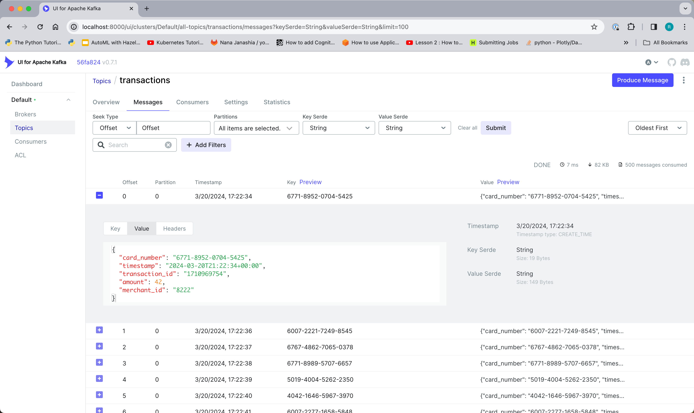
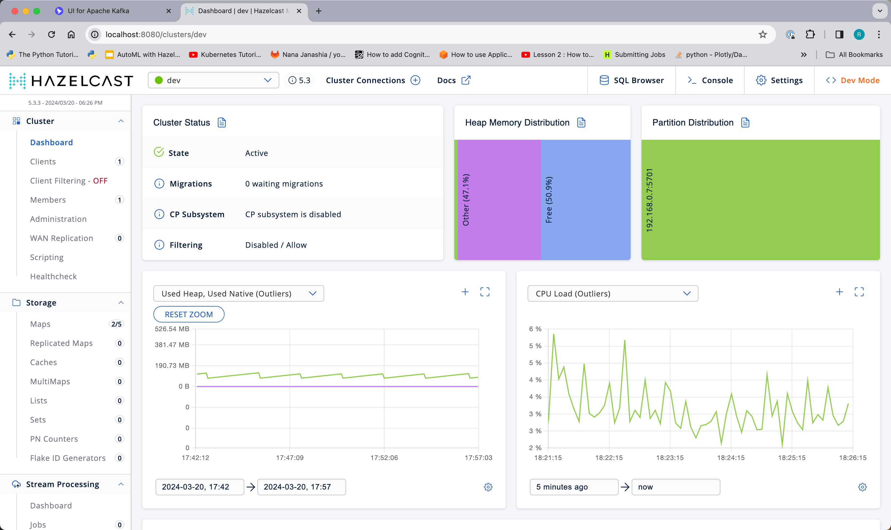
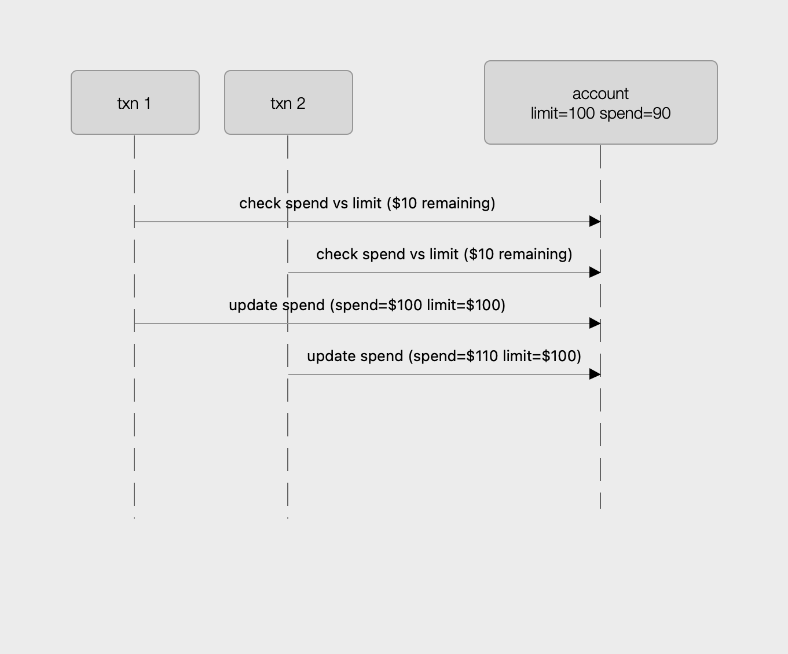
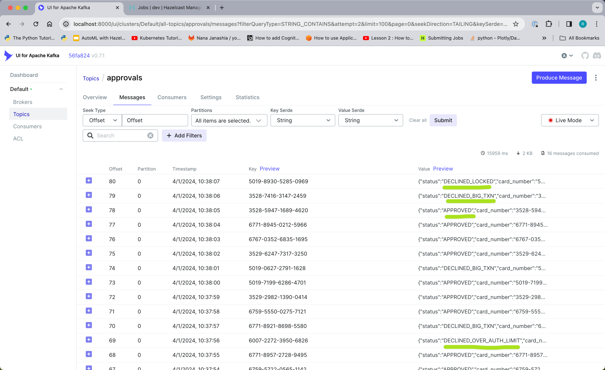

# Overview 

This is a short demonstration of user code deployment.  In this lab we will be working 
with a system that uses an entry-processor to update an account balance and then 
we will update the entry-processor without restarting the cluster.


# Prerequisites 

You will need a development laptop with the following installed:
- Docker Desktop
- A functional Java IDE
- Maven
- __Hazelcast Command Line Client (CLC)__

To install Hazelcast CLC, see: https://docs.hazelcast.com/clc/latest/install-clc

# Overview of the Environment

Most of the components of this lab run within an isolated Docker environment. To allow 
you to interact with the components from outside the Docker environment some 
components are exposed on localhost ports.  For example, when you run CLC it will 
connect to one of the Hazelcast instances via `localhost:5701`.  The diagram below 
should help to clarify the situations.


# Lab 0: Verify the environment

To start the lab environment, run the following from a command line:  
> `docker compose up -d`

Let's connect the Hazelcast CLI to the Hazelcast instance running in docker.

> ```
> clc config add docker cluster.name=dev cluster.address=localhost:5701
>  OK Created the configuration at: /Users/rmay/.hazelcast/configs/docker/config.yaml
> ```

This command saves the cluster connection information in a configuration file as shown 
in the output.  In this case, "docker" is the name of the configuration we have 
created.  In subsequent commands, use the "-c" flag to designate a named configuration.
Verify your new configuration is valid using the following command.

> ```
> clc -c docker  job list
> OK No jobs found.
> ```

Use the Kafka UI at  http://localhost:8000 to inspect the messages in the "transactions"
topic.



You can also access the Hazelcast Management Center at http://localhost:8080 



# Lab 1: Deploy a Service 

For this lab the pipeline has already been built for you.  It simply reads every 
message from the "transactions" topic and publishes an approval on the "approvals" 
topic.  


Check out the code in `hazelcast.platform.labs.payments.AuthorizationPipeline` 

Build and deploy the Pipeline. From a command prompt in the project root directory run:
```shell
mvn clean install
clc -c docker  job submit payment-pipelines/target/payment-pipelines-1.0-SNAPSHOT.jar redpanda:9092 transactions approvals --class hazelcast.platform.labs.payments.AuthorizationPipeline
```

To verify it worked, check the "Jobs" section of Hazelcast Management Center (http://localhost:8080) 
and also use the Kafka UI (http://localhost:8000) to see that there are messages in the "approvals" topic.

You can also use CLC to check the status of the job:
```shell
clc -c docker  job list
 Job ID              | Name          | Status  | Submitted           | Completed
 0b6d-f591-2180-0001 | Fraud Checker | RUNNING | 2024-03-22 11:50:01 | -
```

### progress check
- [ ] How to implement an event-driven microservice using the `Pipeline` API
- [ ] How to access the built-in fast data store from within a `Pipeline`
- [ ] How to keep necessary state in a `Pipeline`
- [x] how to deploy your service to the Hazelcast platform
- [ ] how to scale your service
- [ ] how to update your service

# Lab 2: Check for Large Payments

> __TIP__
>  
> Make sure you are familiar with the `map` method of `StreamStage`

Let's start with a simple rule.  If the transaction amount is over 5,000 then 
decline it by setting the status field to `DECLINED_BIG_TXN` (an enum).  The shell
of the Pipeline is provided in the `AuthorizationPipeline` class of the `payment-pipelines` 
project.   Both the input and output are a `Transaction` object. 

After you have implemented your pipeline, cancel the previously running job, 
either from the ui or with CLC (`clc -c docker job cancel my-job-id`), rebuild 
the project (`mvn clean install`) and re-deploy using the same steps as above.

> __NOTE__
>  
> With the Community Edition, events that arrive while the job is un-deployed, 
> will not be processed.  With the Enterprise Edition, you can take a snapshot 
> before un-deploying the job.  The snapshot will include the in-flight state 
> and the index position of the source.  When you deploy a new job, you can 
> choose to start it from a snapshot, in which case the job will resume 
> where it left off and no events will be missed.

### progress check
- [ ] How to implement an event-driven microservice using the `Pipeline` API
- [ ] How to access the built-in fast data store from within a `Pipeline`
- [ ] How to keep necessary state in a `Pipeline`
- [x] how to deploy your service to the Hazelcast platform
- [ ] how to scale your service
- [x] how to update your service# Lab 3: Check for Locked Cards

# Lab 3: Check for Locked Card
> __TIP__
>
> Make sure you are familiar with the `groupingKey` method of `StreamStage` and 
> the mapUsingIMap` method of `StreamStageWithKey`

In this lab, you will need to pull in additional information from the "cards"
IMap to determine whether the customer has locked their card.  If the card is 
locked, decline the transaction by setting the status field to `DECLINED_LOCKED` 
As with the previous lab, both the input and output are a `Transaction` object.

Add this stage to the pipeline then re-deploy and test your service. Additional 
guidance is provided in `AuthorizationPipeline.java`.

The `mapUsingIMap` method used in this lab is important because it addresses 
data enrichment, something almost all pipelines need to do. 

### progress check
- [ ] How to implement an event-driven microservice using the `Pipeline` API
- [x] How to access the built-in fast data store from within a `Pipeline`
- [ ] How to keep necessary state in a `Pipeline`
- [x] how to deploy your service to the Hazelcast platform
- [ ] how to scale your service
- [x] how to update your service

# Lab 4: Check the Authorization Limit

> __TIP__
>
> Make sure you are familiar with the `mapsStateful` method of `StreamStageWithKey`
> Also, be sure to have a look at the `CardState` class.

In this lab, you will need to both read information that is not on the event
(the authorization limit and the amount authorized) and possibly update 
it (amount authorized).  That means this is a stateful operation and you 
will use `mapStateful`.

Note that the credit limit check and the update have to be done together.  It might 
seem that one stage could do the check and the next one could update the state but, 
this will not work.  See the sequence diagram below that illustrates how this 
approach could lead to the wrong result.



Implement the above functionality in your pipeline and re-deploy it.  If you 
look at the "approvals" topic you should be able to see many APPROVED transactions 
as well as transactions in DECLINED_LOCKED, DECLINED_OVER_AUTH_LIMIT and 
DECLINED_BIG_TXN status.



Congratulations!  You now have a rudimentary payment pipeline that can easily
scale to handle 1000's of transactions per second.

### progress check
- [x] How to implement an event-driven microservice using the `Pipeline` API
- [x] How to access the built-in fast data store from within a `Pipeline`
- [x] How to keep necessary state in a `Pipeline`
- [x] how to deploy your service to the Hazelcast platform
- [ ] how to scale your service
- [x] how to update your service

# Lab 5: Scale It Up

Once you've written a pipeline, all you need to do to scale it up is 
add more nodes! The Hazelcast platform takes care of the rest.

To scale up, run the following command to start 2 more nodes.
```shell
docker compose --profile scaleup up -d 
```

Using management center, you can see that 2 more nodes have joined the 
cluster. When you add or remove cluster nodes, Hazelcast will undeploy the job,
re-plan it for the new number of nodes, and then re-redploy it. 

That's all there is to it!

> __NOTE__
> 
> With Hazelcast Community Edition, the events that arrive between the time
> that the pipeline is undeployed and the time that it is re-deployed will 
> not be processed.
> 
> With Hazelcast Enterprise, you can specify a processing guarantee of 
> __at-least-once__ or __exactly-once__.  In that case, the Hazelcast 
> platform will take a snapshot of the pipeline state, including position 
> in all sources, and will resume the job from that snapshot. See
> https://docs.hazelcast.com/hazelcast/5.3/fault-tolerance/fault-tolerance#processing-guarantee-is-a-shared-concern
> for details.

### progress check
- [x] How to implement an event-driven microservice using the `Pipeline` API
- [x] How to access the built-in fast data store from within a `Pipeline`
- [x] How to keep necessary state in a `Pipeline`
- [x] how to deploy your service to the Hazelcast platform
- [x] how to scale your service
- [x] how to update your service


# The End

You have reached the end of this course. Well done!  If you would like to 
learn more about the Hazelcast platform, please check out http://training.hazelcast.com

To stop everything, use the following command.
```shell
docker compose --profile scaleup down
```

